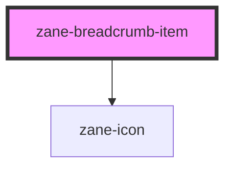

# zane-breadcrumb-item

<!-- Auto Generated Below -->

## Properties

| Property  | Attribute | Description | Type                | Default     |
| --------- | --------- | ----------- | ------------------- | ----------- |
| `replace` | `replace` |             | `boolean`           | `false`     |
| `to`      | `to`      |             | `string \| unknown` | `undefined` |

## Events

| Event    | Description | Type                                              |
| -------- | ----------- | ------------------------------------------------- |
| `zClick` |             | `CustomEvent<{ to?: string; replace: boolean; }>` |

## Dependencies

### Depends on

- [zane-icon](../icon)

### Graph

----------------------------------------------

*Built with [StencilJS](https://stenciljs.com/)*
