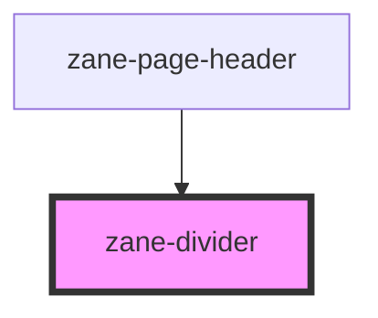

# zane-divider

<!-- Auto Generated Below -->

## Properties

| Property          | Attribute          | Description | Type                            | Default        |
| ----------------- | ------------------ | ----------- | ------------------------------- | -------------- |
| `borderStyle`     | `border-style`     |             | `string`                        | `'solid'`      |
| `contentPosition` | `content-position` |             | `"center" \| "left" \| "right"` | `'center'`     |
| `direction`       | `direction`        |             | `"horizontal" \| "vertical"`    | `'horizontal'` |

## Dependencies

### Used by

 - [zane-page-header](../page-header)

### Graph

----------------------------------------------

*Built with [StencilJS](https://stenciljs.com/)*
