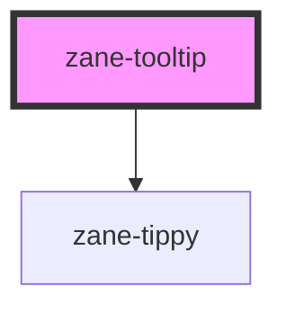

# zane-tooltip

<!-- Auto Generated Below -->

## Properties

| Property      | Attribute       | Description                                                                                                            | Type                                                                     | Default                                |
| ------------- | --------------- | ---------------------------------------------------------------------------------------------------------------------- | ------------------------------------------------------------------------ | -------------------------------------- |
| `appendTo`    | `append-to`     | Which element the tooltip content appends to                                                                           | `"parent" \| ((ref: Element) => Element) \| HTMLElement`                 | `TOOLTIP_OPTIONS_DEFAULTS.appendTo`    |
| `autoClose`   | `auto-close`    | Automatically hide the Tooltip after milliseconds (0 means disabled)                                                   | `number`                                                                 | `TOOLTIP_OPTIONS_DEFAULTS.autoClose`   |
| `content`     | `content`       | Display content, can be overridden by slot#content                                                                     | `string`                                                                 | `undefined`                            |
| `disabled`    | `disabled`      | Whether Tooltip is disabled                                                                                            | `boolean`                                                                | `TOOLTIP_OPTIONS_DEFAULTS.disabled`    |
| `effect`      | `effect`        | Tooltip theme, built-in themes: 'dark' \| 'light'                                                                      | `string`                                                                 | `TOOLTIP_OPTIONS_DEFAULTS.effect`      |
| `enterable`   | `enterable`     | Whether the mouse can enter the tooltip content                                                                        | `boolean`                                                                | `TOOLTIP_OPTIONS_DEFAULTS.enterable`   |
| `hideAfter`   | `hide-after`    | Delay before hiding the Tooltip (ms)                                                                                   | `number`                                                                 | `TOOLTIP_OPTIONS_DEFAULTS.hideAfter`   |
| `hideOnClick` | `hide-on-click` | Whether to hide the tooltip when clicking outside                                                                      | `boolean`                                                                | `TOOLTIP_OPTIONS_DEFAULTS.hideOnClick` |
| `maxWidth`    | `max-width`     | Max width of the tooltip content                                                                                       | `number \| string`                                                       | `TOOLTIP_OPTIONS_DEFAULTS.maxWidth`    |
| `offset`      | `offset`        | Offset of the Tooltip content from the reference element. Accepts array [skidding, distance] or string like "[0, 12]". | `[number, number] \| string`                                             | `TOOLTIP_OPTIONS_DEFAULTS.offset`      |
| `placement`   | `placement`     | Position of Tooltip                                                                                                    | `string`                                                                 | `TOOLTIP_OPTIONS_DEFAULTS.placement`   |
| `popperClass` | `popper-class`  | Custom class for the tooltip popper                                                                                    | `string`                                                                 | `undefined`                            |
| `popperStyle` | --              | Custom style for the tooltip popper                                                                                    | `any \| string`                                                          | `undefined`                            |
| `rawContent`  | `raw-content`   | Whether content is treated as HTML string                                                                              | `boolean`                                                                | `TOOLTIP_OPTIONS_DEFAULTS.rawContent`  |
| `showAfter`   | `show-after`    | Delay before showing the Tooltip (ms)                                                                                  | `number`                                                                 | `TOOLTIP_OPTIONS_DEFAULTS.showAfter`   |
| `showArrow`   | `show-arrow`    | Whether the tooltip has an arrow                                                                                       | `boolean`                                                                | `TOOLTIP_OPTIONS_DEFAULTS.showArrow`   |
| `teleported`  | `teleported`    | Whether tooltip content is teleported, if true it will be appended to appendTo                                         | `boolean`                                                                | `TOOLTIP_OPTIONS_DEFAULTS.teleported`  |
| `transition`  | `transition`    | Animation name                                                                                                         | `string`                                                                 | `TOOLTIP_OPTIONS_DEFAULTS.transition`  |
| `trigger`     | `trigger`       | How should the tooltip be triggered. Supports single or array of: 'hover' \| 'focus' \| 'click' \| 'contextmenu'       | `"click" \| "contextmenu" \| "focus" \| "hover" \| TooltipTriggerType[]` | `TOOLTIP_OPTIONS_DEFAULTS.trigger`     |
| `visible`     | `visible`       | Visibility of Tooltip. When set, tooltip becomes controlled.                                                           | `boolean`                                                                | `undefined`                            |
| `zIndex`      | `z-index`       | Z-index of the tooltip                                                                                                 | `number`                                                                 | `TOOLTIP_OPTIONS_DEFAULTS.zIndex`      |

## Events

| Event            | Description                                                          | Type                   |
| ---------------- | -------------------------------------------------------------------- | ---------------------- |
| `zBeforeHide`    | Emitted before the tooltip hides                                     | `CustomEvent<void>`    |
| `zBeforeShow`    | Emitted before the tooltip shows                                     | `CustomEvent<void>`    |
| `zHide`          | Emitted after the tooltip hides                                      | `CustomEvent<void>`    |
| `zShow`          | Emitted after the tooltip shows                                      | `CustomEvent<void>`    |
| `zVisibleChange` | Emitted when visible state changes (for external controlled binding) | `CustomEvent<boolean>` |

## Methods

### `hide() => Promise<void>`

#### Returns

Type: `Promise<void>`

### `show() => Promise<void>`

#### Returns

Type: `Promise<void>`

### `toggle() => Promise<void>`

#### Returns

Type: `Promise<void>`

## Dependencies

### Depends on

- [zane-tippy](../tippy)

### Graph

----------------------------------------------

*Built with [StencilJS](https://stenciljs.com/)*
